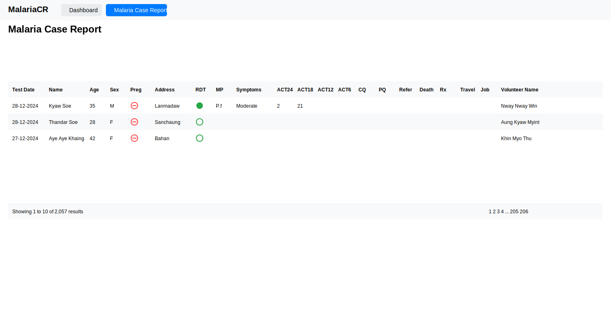
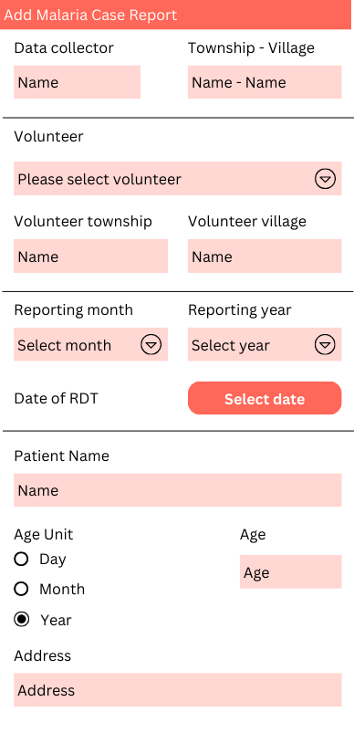
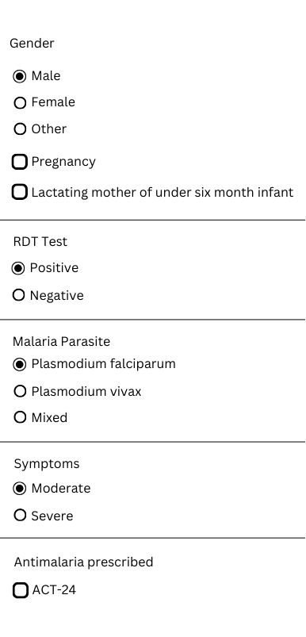
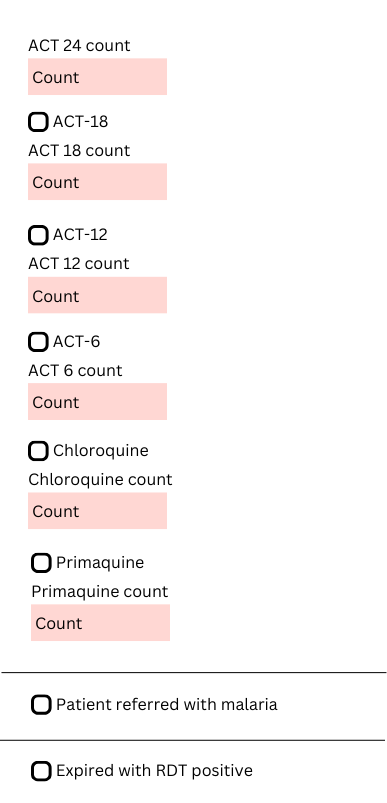
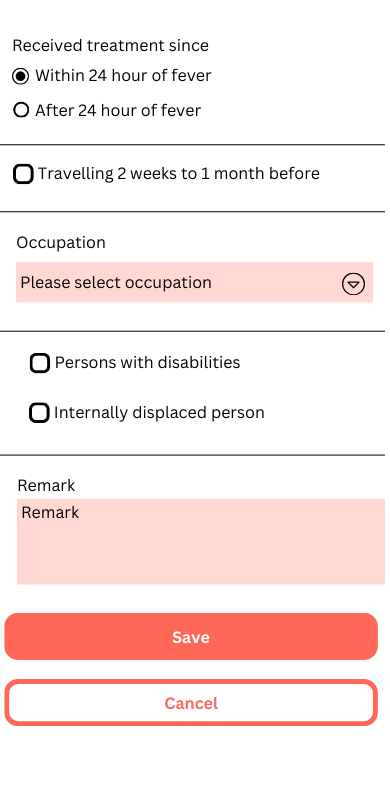

# Internship Project Specifications
## Introduction
The application aims to help local community and health network track and manage malaria cases in local communities. This mobile application and web dashboard will replace paper-based reporting systems to improve data accuracy and response time.

## Development Tools and Environment Setup

### IDE and Development Environments
1. Visual Studio Code
   - Version: Latest stable release
   - Required Extensions:
     - Flutter/Dart
     - PHP Intelephense
     - Laravel Blade formatter
     - PHP namespace resolver

2. Android Studio
   - Version: Latest stable release
   - Android Emulator setup
   - Physical device debugging setup

### Backend Development Tools
1. PHP
   - Version: 8.1 or higher

2. MySQL
   - Version: 8.0 or higher

3. Laravel Framework
   - Version: 10.x
   - Composer (PHP package manager)
   - Required packages:
     - Laravel Sanctum (API authentication)
     - Laravel Excel (for report exports)

4. FilamentPHP
   - Version: 3.x

### Frontend and Mobile Development
1. Node.js
   - Version: LTS (18.x or higher)
   - NPM or Yarn package manager

2. Flutter/Dart SDK
   - Flutter SDK: Latest stable version
   - Dart SDK: Latest stable version
   - Flutter dev tools
   - Required packages:
     - sqflite
     - http
     - provider
     - shared_preferences

### Version Control and Collaboration
1. Git
   - Latest version

2. Collaboration Tools
   - Postman (API testing)

## User Roles and Responsibilities
* Community health workers who collected field data
* Supervisors who monitor reports
* System administrators who manage user accounts
* Data analysts who need access to aggregate information

## Data Collection Requirements
* Patient demographic information
* Test result and Malaria parasite if positive
* Medication prescribed
* Geographical location of cases

## Offline functionality
* Data collection and local database storage to work offline
* Data will be stored locally using SQLite database
* Data synchronization will occur one-way from device to server
* Data synchronication will happen manually when the user gets online and tap the "Send" button
* Handling conflicts during sync

## User Interface Flow
### Login and Authentication process
**Account creation**

User accounts can be created by the web admin for each user which can be used across multiple devices. User registration is not opened for the mobile app.

**Web and mobile authentication**

Login email and password registered on the web dashboard can be logged in through mobile. On the first login, both web and mobile users can opt to remember on this device.

Web authentication will store access tokens in the database while mobile authentication will store access tokens in the local database.

### Main Dashboard layout

### Case reporting workflow

### Data review and editing capabilities
In both mobile and web, a readonly view page for review and an edit page reusing the same components without building again.

### Report generation interface
Report generation to be carried out in web interface. Web tables to view realtime online and download PDF, CSV exports features.

## Security and Privacy
### User Authentication methods
Authentication in Laravel. Mobile authentication through Laravel auth api.

### Role-based access control
Role based access control to be carried out in web platform. Will include:
* Super Admin
* Admin
* User

## Technical Architecture
* Mobile platform (Flutter)
* Backend framework (Laravel)
* Database structure
* API endpoints

## Reporting and Analysis

### Types of Reports

#### Simple Case Report Table
- Individual case details showing raw data entries
- Fields include patient information, test results, treatment given, and volunteer details
- Sortable and filterable by date, location, and volunteer
- Option to view complete case details for each entry

#### Aggregate Tables

1. Monthly Case Summary
- Tracks total cases, RDT tests performed, and positive cases by month
- Monitors referral cases and deaths
- Helps identify seasonal patterns and trends
- Key metrics:
  - Total cases
  - RDT tests performed
  - Positive cases
  - Referral cases
  - Deaths

2. Treatment Distribution Report
- Shows treatment types administered monthly
- Tracks different ACT dosages (ACT24, ACT18, ACT12, ACT6)
- Monitors chloroquine and primaquine usage
- Helps with medicine stock management

3. Volunteer Performance Dashboard
- Performance metrics by volunteer
- Includes total patients seen, tests performed, and positive cases
- Geographic coverage (township and village level)
- Helps identify training needs and high performers

4. Geographic Distribution Analysis
- Case distribution by township and village
- Identifies malaria hotspots
- Tracks positive case rates by location
- Aids in resource allocation

5. Demographic Analysis Report
- Age group distribution (<5, 5-15, >15 years)
- Gender distribution
- Special categories (pregnancy, under-six-month infant)
- Helps target interventions for vulnerable groups

### Data Visualization
- Line graphs for temporal trends
- Bar charts for treatment comparisons
- Pie charts for demographic breakdowns
- Performance dashboards for volunteers
- Interactive charts with filtering capabilities

### Export Formats
- CSV for raw data export
- PDF for printable summaries
- JSON for system integration
- Monthly report generation

## Implementation phases
### Phase 1 Core Features
* Database structure
* Web authentication
* Web API for authentication
* Setting up mobile authentication
* Setting up mobile data storage
* Building mobile case reporting forms

### Phase 2 Enhanced functionality
* Synchronization
* Build web interface
* Basic reporting
* Data visualization

### Phase 3 Advanced features
* Automated alerts
* Data analysis